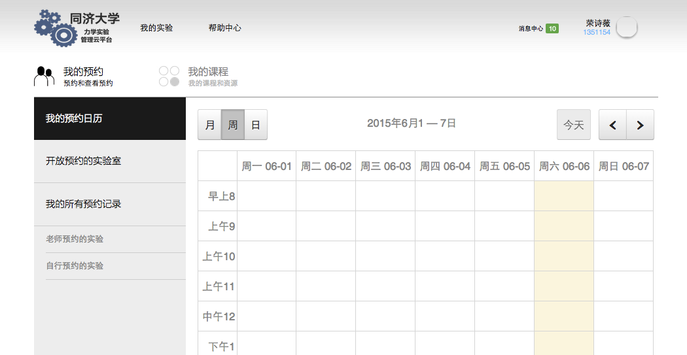
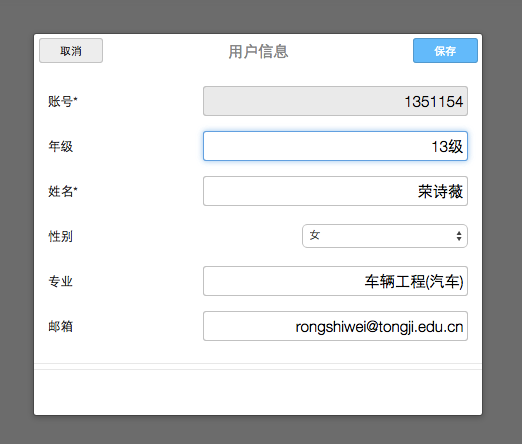
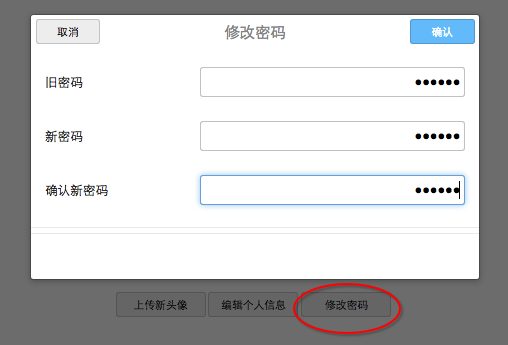
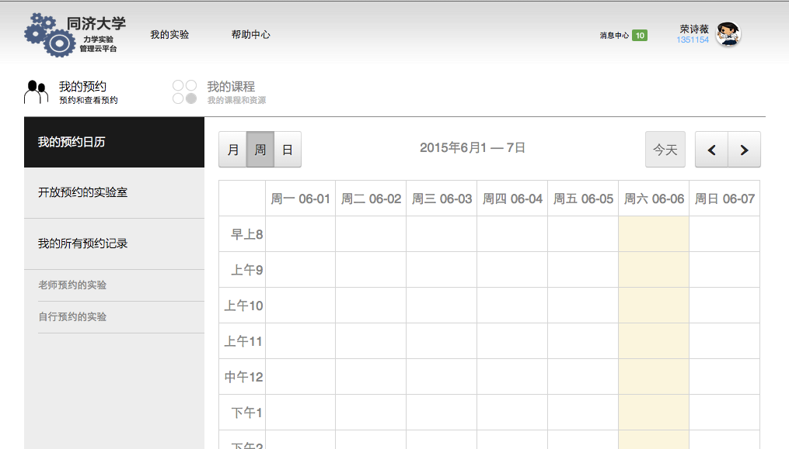
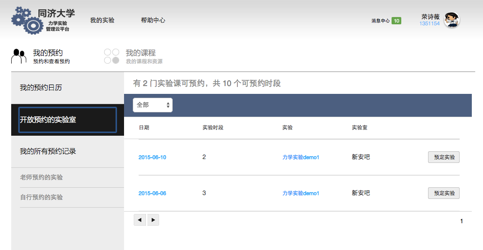
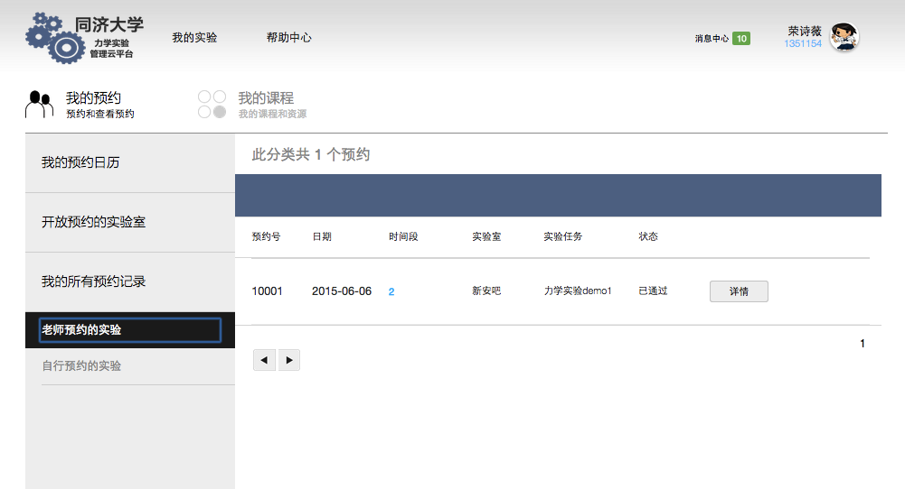
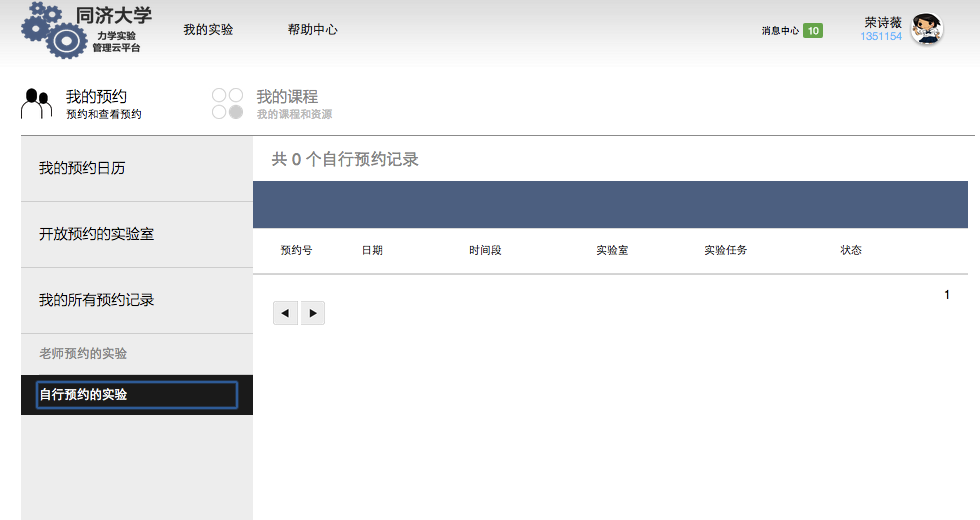
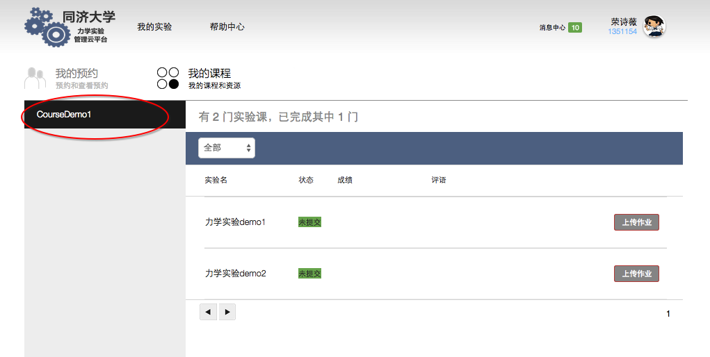

# LabConsole 学生

本文档将介绍学生的使用流程，并对业务部分进行解释。

## 综述
学生可以通过lab console 进行如下工作：
*	登陆labconsole
*   进入LabConsole的主页，输入学号密码进行登陆
*   退出登录
*   个人信息管理
*   密码遗失可以通过联系管理员重置密码
*   可以在自己的主页上修改头像、个人信息、密码等个人资料
*   查看实验预约
*   查看教师为学生所在班级预约的实验。
*   本学期，分当前预约（日期为今天及以后），和已过期预约
*   状态为教师为本班级预约，且管理员已经批准的
*   个人预约实验
*   对于开放个人预约的实验，可以申请加入
*   查看自己已经选修过的课程（过往学期和本学期）
* 查看当前学期的课程以及实验记录
*   实验数据(LabShell上传）
*   实验报告(自己下载完成并上传） 
*   实验成绩以及实验评价（教师输入）

注意：
学生的账号是通过教师提交班级名单建立的。学生第一次登录，使用初始密码“222222”。并且在第一次登陆后尽快修改初始密码。

##登录

* 在LabConsole主页上输入学号和密码。

* 登录成功后，进入学生主界面。
注意： 如果忘记密码，可以请求管理员重置密码后登录。

* 点击右上角的个人信息图标，进行个人资料更新。

* 为自己选择新头像。 

* 编辑个人资料。可以修改个人信息。

* 建议初次登录后立即修改初始密码。

##查看预约

*  在日历中查看实验安排。

注意：
学生只能看到已经批准的预约。

*  实验预约日程表可以查看某一月、某一周和某一日的日程安排

*  在列表中查看实验预约通知。

*  开放可供自己预约的实验

*  班级预约

*  自己已经预约成功的实验

##我的课程

注意：
在我的班级中查看自己本学期的课程。我的班级包括自己名下的每个实验记录。

*   查看我的课程

*  查看我班级名下的实验

