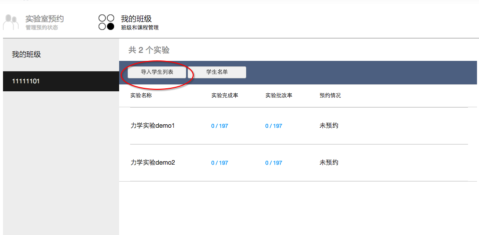
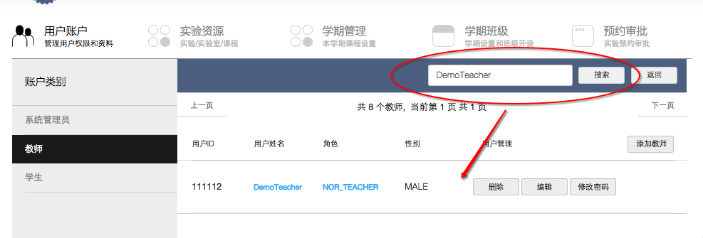

# LabConsole 教师

本文档将介绍教师的使用流程，并对业务部分进行解释。

## 综述

教师可以通过lab console 进行如下工作：

*	登陆labconsole
    *   进入LabConsole的主页，工号密码进行登陆
    *   退出登录
*   个人信息管理
    *   密码遗失可以通过联系管理员重置密码
    *   可以在自己的主页上修改头像、个人信息、密码等个人资料
*   查看实验预约
    *   可以在提醒列表中查看自己申请的预约及其审批状况
*   预约实验室
    *   可在日程表中查看自己的实验室预约
    *   通过日历的方式选择相应的日期进行预约
        *   可以取消已经完成，但是管理员尚未批准的预约
        *   管理员已经批准的预约不可取消
    *   已经批准的预约出现在“查看实验预约”的“我的预约”栏目中
*   查看本学期所教授班级的学生实验记录
    *   查看本学期自己名下的班级
    *   为班级添加学生列表 
    *   班级下可查看学生名单
    *   在班级中可以查看本班级需要完成的实验，以及实验完成的情况
    *   可以查看本班级学生每个实验完成的情况，下载实验数据以及实验报告，并评分。

##登录

* 在LabConsole主页上输入工号和密码。

* 登录成功后，进入教师主界面。
注意： 如果忘记密码，可以请求管理员重置密码后登录。

* 点击右上角的个人信息图标，进行个人资料更新。

进入个人更新主页

* 为自己选择新头像。 

* 编辑个人资料。可以修改个人信息。

* 建议初次登录后立即修改初始密码。

##查看预约

*  在日历中查看实验安排。其中申请通过的预约为绿色，尚未批准的预约为红色

*  实验预约日程表可以查看某一月、某一周和某一日的日程安排

*  在列表中查看实验预约通知。
    *   已经批准的预约

*   尚未批准的预约

*   实效的预约

##我的班级

    注意：
    在我的班级中查看自己本学期的班级。班级包括学生的名单，实验列表，以及每个实验的的学生数据记录

    
*   对于新添加的班级，教师需要将教务处的学生名单上传，生成学生纪录。教师添加的学生，将生成学生的账户信息，学生因此可以使用学号和初始密码登录。

*   被导入的学生名单的格式如下。

    
    注意：
    由于系统的兼容性问题，教务处网站下载的班级学生名单，需要进行另存为操作，才可以被LabConsole接收。

*   上传后，查看学生名单可以看到学生名单纪录

实验计划。在实验列表下，教师可以看到实验完成的情况，并进行相应的批改

*  在学生完成实验之后，教师可以点击查看学生的实验记录。

