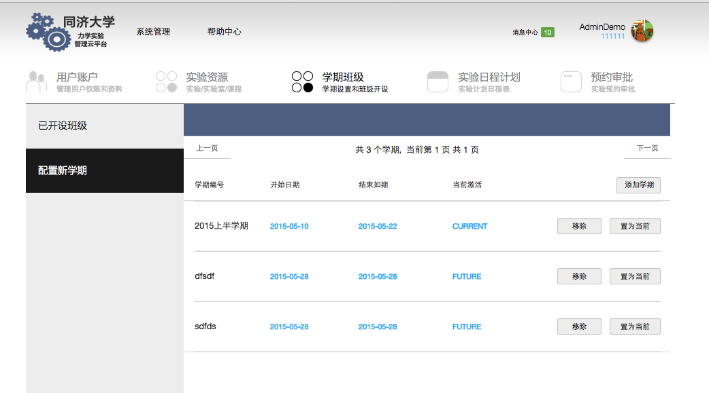

# LabConsole 管理员手册

本文档将介绍管理员的使用流程，并对业务部分进行解释。

## 综述

**LabConsole** 帮助实验室管理员进行完备的实验室设备、使用人员以及实验室预约分配流程的管理。
实验室管理员可以在LabConsole上进行如下工作:

*	LabConsole用户管理
	*	管理员权限管理
	* 	实验课教师权限管理
	* 	管理员权限管理
	*	学生权限管理
*	实验资源管理
	*	实验室管理
	*	试验机管理
	*	（实验中心所支持的）实验管理
	*	（实验中心所支持的）课程管理
*	学期课程管理
	*	学期管理
	*	本学期课程添加和配置管理
*	实验预约日程表管理
	*	实验室预约日程表管理
	*	为教师预约实验
	*	开放学生自行预约实验
*	实验预约的审批流程
	*	对实验室预约申请的审批
	*	对已经通过的预约，配置实验室管理人员

##创建新的管理员账号并登录

首先需要系统管理员账号登入系统（请咨询系统管理员）。

* 添加系统管理员

* 使用搜索功能，在列表中查询新添加的管理员记录。

* 查看新添加的管理员记录并修改其个人信息。

* 管理员默认密码为“222222”， 在此设置新密码。此功能可用于用户密码重置。

* 使用新添加的账户进行登录。在LabConsole主页上输入用户名和密码。

* 登录成功后，进入管理员主界面。
    注意： 如果忘记密码，可以请求其他管理员重置密码后登录，参见Step 4. 

* 点击右上角的个人信息图标，进行个人资料更新。

* 为自己选择新头像。 

* 编辑个人资料。可以修改姓名，性别，职务等信息。

* 建议初次登录后立即修改初始密码。

至此，新用户“111111-AdminDemo” 已经建立，并且可以使用系统中的管理员特权。

##用户管理

LabConsole 管理员通过“用户管理”功能管理所有使用本实验中心资源的用户。包括：
＊ 系统管理员
＊ 实验中心教师
＊ 实验教师
＊ 任课教师
＊ 实验教师兼任课教师
＊ 实验中心学生

其中，**管理员** 和**教师**是通过管理员身份用户逐一独立添加的。而学生用户可以通过独立界面逐一添加，也可以通过教务处上课名单上传批量添加。

点击主导航栏中的“用户账户”图标进入用户管理。

###用户查看

* 在左导航栏的“用户类别”中选择'**系统管理员**'。查看所有的系统管理员。

* 在左导航栏的“用户类别”中选择'**教师**'。查看教师账户。

* 在左导航栏的“用户类别”中选择'**学生**'。查看学生账户。

###添加教师账户

* 教师列表右上方可以看到添加教师按钮，点击后，从弹出窗口中添加教师。

* 通过搜索栏查询特定的教师账户。

* 修改教师信息。

* 点击删除按钮可以删除帐户。

可以输入工号／学号／姓名 进行查找

点击用户的编辑信息，可以修改用信息。修改密码栏目可以为用户重置密码。

注意：
编辑用户可以修改用户信息，但是不能在角色间转换。
如果要修改用户角色，可以先删除用户，再选择新的角色重新添加。

##试验资源管理

实验资源包括：
* 实验室
* 实验室所支持的实验
* 实验支持的课程

所以配置资源应当遵循**实验室－实验－课程**的顺序。

###实验室配置管理

实验室是实验中心的基本资源。实验室包含多台安装有LabShell的试验机，可以通过LabShell与LabConsole进行互动。
实验室配置内容包括：

*	添加／删除实验室
*	设置／修改实验室编号、名称、容量、描述、状态等信息

* 查看实验室列表

* 点击实验室列表右上角图标，添加实验室。

* 删除实验室。 注意，如果实验室已经有预约，则不能删除。 
删除已经使用过的实验室需要在学期生效之前进行。

** 确认删除实验室。

** 被删除实验室从实验室列表中移除。

* 从实验室列表中选定实验室，可以修改属性。
可修改的属性包括，实验室名称、容量、描述、状态。

	实验室状态为开放，则可以通过预约日程表进行预约。反之不能。

###实验配置管理

实验是指实验中心所提供的基本实验类别。比如**“拉伸实验”**, **“扭转实验”** 等。 

*	添加／删除实验
*	设置／修改课程编号、名称、实验小组最少人数以及最大人数
*	为实验添加实验室。

实验通过配置实验室，和实验室产生关联。而通过在课程中配置实验，和课程产生关联。
实验配置包括：

	注意：
		一个实验可以在多个实验室中进行。理论上一个实验室也可以支持多个实验。可以通过在实验配置弹出窗口中的实验室下拉菜单中获取配置支持本实验的实验室。

* 查看实验列表

* 添加新的实验

** 在列表中可以看到新添加的两个实验

* 修改实验描述信息。 实验属性包括试验名称、实验分组最少人数以及最大人数，实验室配置。 
从实验室配置的下拉菜单中可以得到当前实验中心所有的实验室。通过选择并添加实验室，可以设置实验室与实验的关联关系。 

** 为两个新添加的实验都配置了实验室。该配置信息将在未来多次使用。

###课程配置管理

    注意：
    课程是指实验中心提供的实验所需要支持的课程。
    通过配置课程，实验总心可以通过班级与课程，获得实验列表，进一步获取可以进行该实验的实验室列表。

课程配置包括：

*	添加／删除课程
*	设置／修改课程编号、名称、开课单位
*	为课程添加实验

* 查看课程列表

* 添加一门新的课程

** 新添加的课程出现在列表中

** 为新课程配置实验

##学期班级管理

基础设施建设完毕后，可以进行分学期的资源管理。
管理员可以配置新的学期。在当前学期结束后，管理员可以选择并设置时间段为未来时段的一个学期，设置为“当前学期”。LabConsole中所有关于班级、排课等管理都是基于当前学期的。

### 学期配置

* 学期班级->  配置新学期, 可以查看学期列表。仅有一个学期是当前学期。标注为"Current".

可以在学期列表中查看已经配置完成的学期。所有学期中，最多只有一个学期是当前学期。在假期中，当前学期为空。
未来的学期为“future” , 已经结束的学期为Past. 任何学期不能与当前学期冲突。 

* 添加新学期，设置学期名称，以及起止日期。注意日期不要与其他学期日期相冲突。虽然添加的时候系统并不会检查冲突状况。但是时间冲突的学期不能准时开启。这种方式下，系统允许用户设置多个呢能的学期起止点并最终选用其中一个。

* 当当前日期处于**“当前学期”** 和**将要设置的学期**之间的时候，可以开启新学期。将启用新的学期，并将所有预约、班级信息清空。使用开启新学期需要非常谨慎。

### 班级配置

**学期班级管理** 帮助管理员查看和配置每个学期，以及学期内开课的班级。

当前学期生效后，才可以配置本学期的班级。

与教务处的逻辑相同，在LabConsole中，班级为特定课程在学期内的实现。比如课程号为“001234”材料力学课程，在2015-2016秋季学期开设“00123401”， “00123402”“00123403”三个班级，供不同的学生选修。

管理员需要通过教师递交的申请确定本中心本学期支持的班级，并将班级信息录入到系统中。

* 点击查看本学期已经开设的班级列表

* 开设新的班级。新开设班级中，需要选择一门现有的课程，并选择授课教师。

** 添加的班级加入到班级列表中

* 可以对任何班级修改配置

* 没有预约纪录的班级可以删除

    注意：
    班级添加成功后，需要任课教师在教室管理平台上上传学生名单，LabConsole才能提供对班级实验完整的服务。

##实验室日程

管理员可以通过实验室预约功能，为教师进行实验室预约，或者查看教师的预约。

###实验室日历

按照年月日的顺序显示目前已经预约的实验室情况。

* 选择实验室日程计划，可以看到实验中心实验室的日程安排

* 点击到任何一空白日历，可以为教师添加预约。添加预约时，系统会自动筛选出教师－课程-实验- 实验室信息，便于用户填写

* 预约成功后，可以在日程表中查看。
蓝色表示开放学生预约，红色表示申请中尚未审批。绿色表示已经审批通过的教师班级预约

点击查看已经通过审批的预约

点击查看尚未通过审批的预约。管理员可以在此界面上审批通过并分配实验员

点击查看开放学生预约的实验室。如果学生已经预约，可以看到学生名单

查看一月内的整体预约情况

查看某一日的预约情况

###实验室预约

可以帮助教师预约实验室。
预约向导将筛选出与教师、课程、实验匹配的实验室供使用者勾选。

###预约审批

教师和管理员的预约按照时间顺序列表待审批。
管理员可以通过或者拒绝预约的申请。对于通过的申请，管理员需要从下拉菜单中选择实验教师。

* 点击导航栏的**预约审批**进入预约审批清单，可以看到所有待审核的实验室申请

* 拒绝一个申请，将其从实验计划日程中删除

* 批准一个申请，可以从下拉菜单中选择**实验教师**, 安排教师实验任务

* 批准后名单从**尚未审批的名单**中去除，并进入**已经审批的名单**中

** 已经审批的名单

* 日程表中查看刚才审批通过的实验申请。已经变为绿色。

** 分日日程表中查看申请

	注意：
	实验教师登陆后可以看到自己的实验安排。

